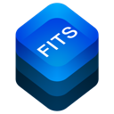
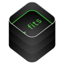

<p align="center">

</p>

<p align="center">
<a href="LICENSE.md">

</a>
<a href="https://swift.org">

</a>


</p>

A native Swift library to read and write FITS files

## Description

FITSCore is a pure Swift library to read, manipulate and write files conforming to the [FITS 4.0](https://fits.gsfc.nasa.gov/fits_standard.html) file format, commonly used to store astronomical data. 

The aim is to implement a modern, native [Swift](https://swift.org) library to utilize the full computing power of modern apple hardware. In particuary, I was seeking for a simple solution to read, render & review FITS files on an iPad.

FITSCore is the plattform independend base library. It compiles and runs on iOS / iPadOS / macCatalys as well as on Linux. Therefore the featureset is quite limited as the standard libraries on linux currently do not provide a lot of convenience for image generation. A deeper integration into the iOS enviornment and standard libaries is provided via the [FITSKit](https://github.com/brampf/fitskit) library.

|  |  |  |
| :---------------------------------------: | :---------------------------------------: | :---------------------------------------: | 
| [**FITSCore**](https://github.com/brampf/fitscore) | [**FITSKit**](https://github.com/brampf/fitskit) | [**FITSTool**](https://github.com/brampf/fitstool) |
|  Fits file format read & write  | Image rendering & manipulation | Command line tool |
|  macOS, iOS & Linux | iOS / macCatalyst | Linux |

## Features
* Read & Write FITS 4.0 files
    * [x] Reading files
    * [x] Write Files
* FITS Extensions
    * [x] Image Extensions
    * [x] ASCII Table Extensions
    * [x] Binary Table
* Native code
    * Swift 5.2
    * Compiles for macCatalyst
    * Compiles for iPadOS
    * Compiles for Linux

## Getting started

### Package Manager

With the swift package manager, add the library to your dependencies
```swift
dependencies: [
.package(url: "https://github.com/brampf/fitscore.git", from: "0.1.0")
]
```

then simply add the `FITS` import to your target

```swift
.target(name: "YourApp", dependencies: ["FITS"])
```

## Documentation

* [Introduction](Doc/DOCU_INTRO.md)
* [Working with Files](Doc/DOCU_FILES.md)
* [Working with HDUs](Doc/DOCU_HDUS.md)
* [Working with Tables](Doc/DOCU_TABLES.md)


### TL;DR

#### Reading FITS Files
```swift
import FITS

/// Parste a FITS File
let fits = FitsFile.read(from: URL("/path/to/some/fits/file"))
```
#### Working with vector data
```swift
import FITS

// Fetch the whole image data
let image : Data = fits.prime.data(naxis: 1, dimension: 0)

// Fetch the read channel from the primary HDU
let red : Data = fits.prime.data(naxis: 3, dimension: 0)
```

### Tests
There are various test cases implemented to verify compability with a variiety of real word examples of FITS files

## License

MIT license; see [LICENSE](LICENSE.md).
(c) 2020
